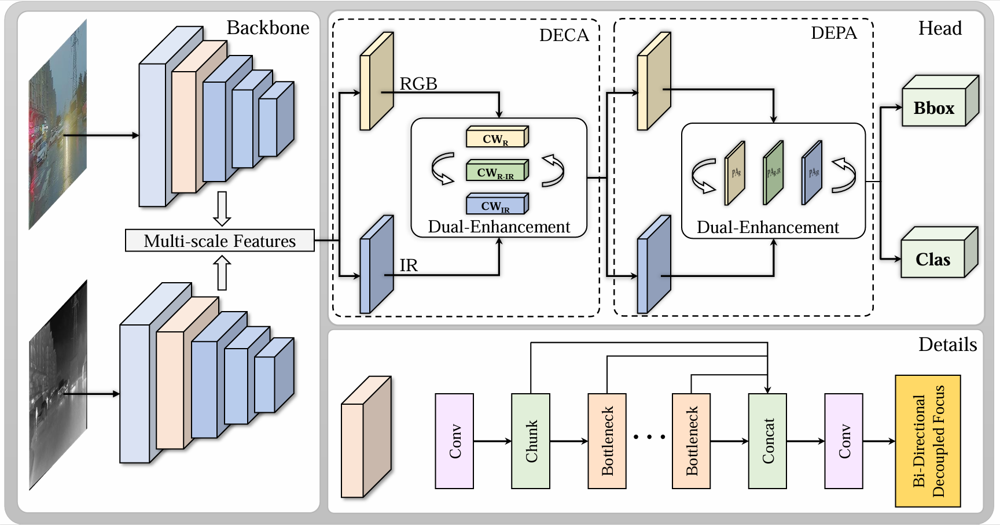
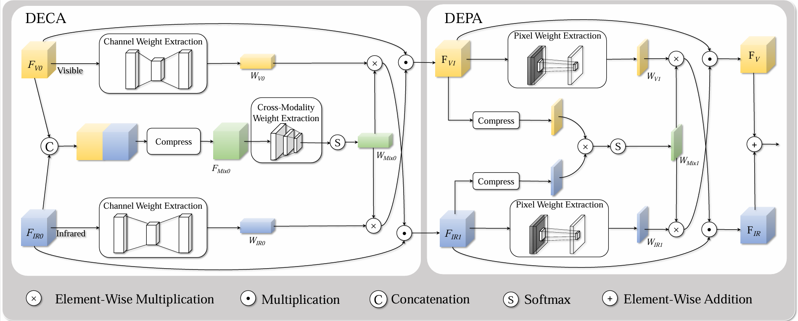
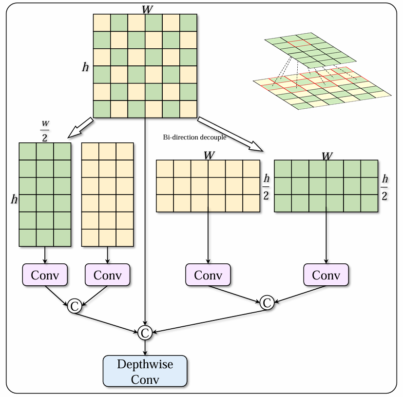
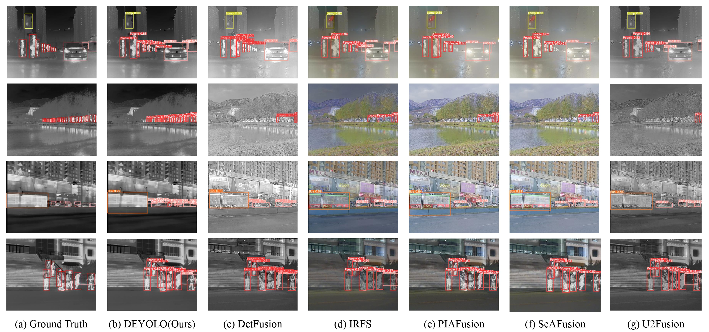
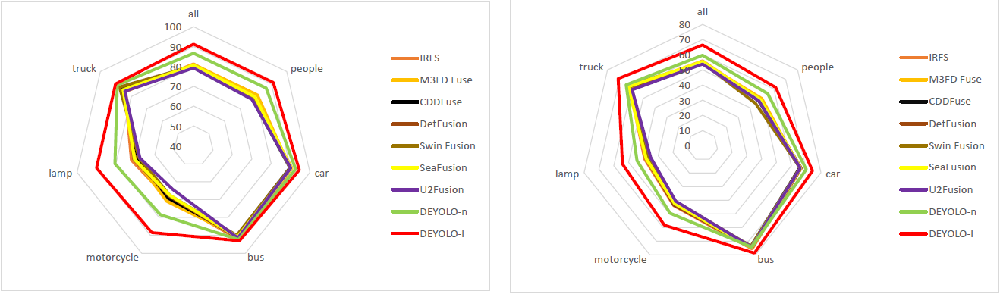

## Document
### Recommended Environment

- [x] torch 1.12.0
- [x] torchvision 0.13.0
- [x] numpy 1.24.5
- [x] nncf 2.13.0
- [x] openvino 2024.4.0
- [x] openvino-dev 2024.4.0
- [x] openvino-telemetry 2025.2.0
- [x] onnx 1.16.1


### Train
You can choose DEYOLO's n/s/m/l/x model in [DEYOLO.yaml](./ultralytics/models/v8/DEYOLO.yaml)

```python
from ultralytics import YOLO

# Load a model
model = YOLO("ultralytics/models/v8/DEYOLO.yaml").load("yolov8n.pt")

# Train the model
train_results = model.train(
    data="M3FD.yaml",  # path to dataset YAML
    epochs=100,  # number of training epochs
    imgsz=640,  # training image size
    device="cpu",  # device to run on, i.e. device=0 or device=0,1,2,3 or device=cpu
)
```

### Predict

```python
from ultralytics import YOLO

# Load a model
model = YOLO("DEYOLOn.pt") # trained weights

# Perform object detection on RGB and IR image
model.predict([["ultralytics/assets/vi_1.png", "ultralytics/assets/ir_1.png"], # corresponding image pair
              ["ultralytics/assets/vi_2.png", "ultralytics/assets/ir_2.png"]], 
              save=True, imgsz=320, conf=0.5)
```

### NNCF quantize
* PTQ：使用PTQ_NNCF.py脚本即可完成int8量化，需要准备校准数据集，使用的是ultralytics中的dataloader。
```python
def create_data_source():
    from ultralytics.yolo.engine.trainer import BaseTrainer
    from ultralytics.yolo.v8.detect.train import DetectionTrainer
    from ultralytics.yolo.utils import DEFAULT_CFG

    cfg = DEFAULT_CFG
    model = "ultralytics/models/v8/DEYOLO.yaml"
    data = cfg.data or "ultralytics/yolo/cfg/M3FD.yaml"  # or yolo.ClassificationDataset("mnist")
    device = cfg.device if cfg.device is not None else ''

    args = dict(model=model, data=data, device=device)
    trainer = DetectionTrainer(overrides=DEFAULT_CFG)
    trainer.setup_model()
    vis_dir = r"D:\company_Tenda\35.DEYOLO\DEYOLO\dataset\images\vis_train"
    inf_dir = r"D:\company_Tenda\35.DEYOLO\DEYOLO\dataset\images\ir_train"
    dataloader = trainer.get_dataloader(
        dataset_path = vis_dir,
        dataset_path2 = inf_dir,
        batch_size = 1,
        rank = -1,
        mode = 'train'  # 或 'val'
    )
    return dataloader


def transform_fn(batch):
    batch_input = dict()
    # 网络的输入节点名称是images和images1
    batch_input['images'] = batch['img'].to(torch.device("cpu"), non_blocking=True).float() / 255
    batch_input['images1'] = batch['img2'].to(torch.device("cpu"), non_blocking=True).float() / 255
    return batch_input
```

或者使用自定义的dataloader类：
```python
class CalibrationDataset:
    def __init__(self, data_path_vis=DATA_PATH_VIS, data_path_ir = DATA_PATH_IR, num_samples=300):

        self.data_path_vis = Path(data_path_vis)
        self.data_path_ir = Path(data_path_ir)
        self.num_samples = num_samples

        # 检查是否有真实图像可用，如果要求模型准确，
        if self.data_path_vis.exists() and len(list(self.data_path_vis.glob("*.*"))) > 0 and self.data_path_ir.exists() and len(list(self.data_path_ir.glob("*.*"))) > 0:
            self.image_files_vis = list(self.data_path_vis.glob("*.*"))[:num_samples]
            self.image_files_ir = list(self.data_path_ir.glob("*.*"))[:num_samples]
            self.use_real_images = True
            print(f"使用真实校准图像: {len(self.image_files_vis)}张")
        else:
            self.use_real_images = False
            print(f"使用随机生成数据: {num_samples}张")

    def __getitem__(self, index):
        if self.use_real_images:
            # 从真实图像加载
            img_path_vis = self.image_files_vis[index % len(self.image_files_vis)]
            img_vis = cv2.imread(str(img_path_vis))
            img_vis = cv2.cvtColor(img_vis, cv2.COLOR_BGR2RGB)

            img_path_ir = self.image_files_ir[index % len(self.image_files_ir)]
            img_ir = cv2.imread(str(img_path_ir))
            img_ir = cv2.cvtColor(img_ir, cv2.COLOR_BGR2RGB)
        else:
            # 生成随机图像
            img_vis = np.random.randint(0, 256, (640, 640, 3), dtype=np.uint8)
            img_ir = np.random.randint(0, 256, (640, 640, 3), dtype=np.uint8)

        # 预处理
        img_vis = cv2.resize(img_vis, (640, 640))
        img_vis = img_vis.transpose(2, 0, 1)  # HWC to CHW
        img_vis = img_vis[np.newaxis, ...]  # 添加批次维度

        img_ir = cv2.resize(img_ir, (640, 640))
        img_ir = img_ir.transpose(2, 0, 1)  # HWC to CHW
        img_ir = img_ir[np.newaxis, ...]  # 添加批次维度
        return {"images": img_vis.astype(np.float32) / 255.0, "images1": img_ir.astype(np.float32) / 255.0}
```

* QAT


## Dataset
Like [M3FD.yaml](./ultralytics/yolo/cfg/M3FD.yaml) and [LLVIP.yaml](./ultralytics/yolo/cfg/LLVIP.yaml) You can use your own dataset.

<details open>
  <summary><b>File structure</b></summary>

```
Your dataset
├── ...
├── images
|   ├── vis_train
|   |   ├── 1.jpg
|   |   ├── 2.jpg
|   |   └── ...
|   ├── vis_val
|   |   ├── 1.jpg
|   |   ├── 2.jpg
|   |   └── ...
|   ├── Ir_train
|   |   ├── 100.jpg
|   |   ├── 101.jpg
|   |   └── ...
|   ├── Ir_val 
|   |   ├── 100.jpg
|   |   ├── 101.jpg
|   |   └── ...
└── labels
    ├── vis_train
    |   ├── 1.txt
    |   ├── 2.txt
    |   └── ...
    └── vis_val
        ├── 100.txt
        ├── 101.txt
        └── ...
```

</details>

You can download the dataset using the following link:
- [M3FD](https://github.com/JinyuanLiu-CV/TarDAL)
- [LLVIP](https://github.com/bupt-ai-cz/LLVIP)

## Pipeline
### The framework
<div align="center">
  
</div>

 We incorporate dual-context collaborative enhancement modules (DECA and DEPA) within the feature extraction
 streams dedicated to each detection head in order to refine the single-modality features
 and fuse multi-modality representations. Concurrently, the Bi-direction Decoupled Focus is inserted in the early layers of the YOLOv8 backbone to expand the network’s
 receptive fields.

### DECA and DEPA
<div align="center">
  
</div>

DECA enhances the cross-modal fusion results by leveraging dependencies between
channels within each modality and outcomes are then used to reinforce the original
single-modal features, highlighting more discriminative channels.  

DEPA is
able to learn dependency structures within and across modalities to produce enhanced
multi-modal representations with stronger positional awareness.

### Bi-direction Decoupled Focus
<div align="center">
  
</div>

We divide the pixels into two groups for convolution.
Each group focuses on the adjacent and remote pixels at the same time.
Finally, we concatenate the original feature map in the channel dimension and
make it go through a depth-wise convolution layer.

## Visual comparison
<div align="center">
  
</div>

## Main Results
<div align="center">
  
</div>

 The mAP<sub>50</sub> and mAP<sub>50−95</sub> of every category in M<sup>3</sup>FD dataset demonstrate the superiority of our method.
 
 Trained Weights：
 - [M3FD](https://pan.baidu.com/s/1fZx0UjFcyTfRqZfgKRSZgA?pwd=3016)
 - [LLVIP](https://pan.baidu.com/s/1rw5qdCbvLTlcREoAsNMRXw?pwd=3016)
 - [Kaist](https://pan.baidu.com/s/1b-NO4lteXK-TwSTBrGuXsQ?pwd=3016)

